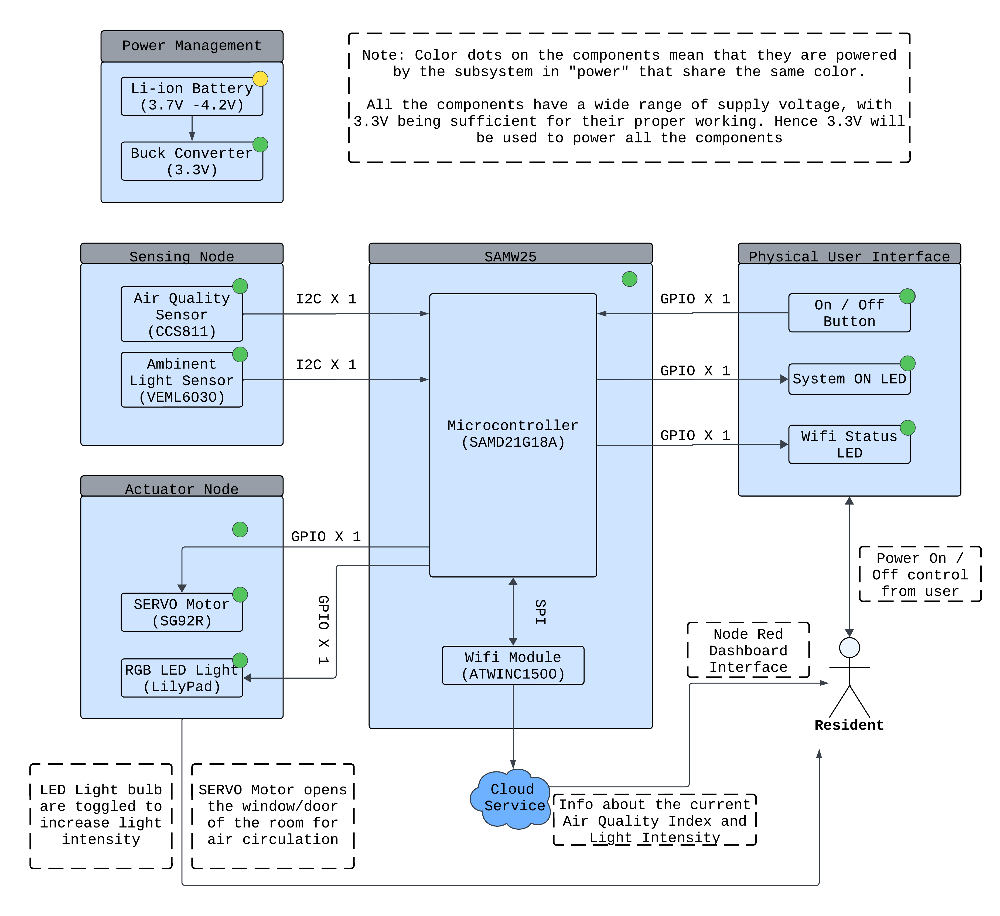

# a14g-final-submission

    * Team Number: 21 
    * Team Name: AirLight
    * Team Members: Suraj Sree Balakrishna Marthy, Akhil Gunda
    * Github Repository URL: https://github.com/ese5160/a14g-final-submission-t21-airlight.git
    * Description of test hardware: AirLight PCBA and House Model, CCS811 Air Quality Sensor Development Board, LilyPad RGB LED, SG92R Servo Motor, J-Link, ASUS ROG STRIX G17(Windows Laptop), Macbook Air M2

## 1. Video Presentation

## 2. Project Summary

### Device Description

 - Our device “AirLight” is an IoT (Internet of Things) based Air Quality Monitoring, Alerting and Actuating system incorporated with an Ambient light measurement and modulating system which could be utilized for continuous checking of the Air Quality (ppm/ppb) and Light Intensity(lux) levels at home.

 - The IoT enabled device is coupled with sensors such as CCS811 (Air Quality IC)(offboard), VEML6030 (Ambient Light Sensor)(onboard) to detect; and actuators such as SG92R SERVO motor, Lilypad RGB LED to take necessary action based on the obtained data evaluated against set thresholds and standards.

 - A Node Red dashboard has been implemented to display the monitored data and to communicate bi-directionally delivering Over-the-Air-Firmware-Updates(OTAFU) to the users.

### Inspiration

 - Recent incident of two master’s students in the US - passed away due to Carbon Monoxide (CO) poisoning from air heater. A serious gas leak happens every 40 hours in the USA, claims more than 120 per year

 - The smoke detectors that are generally installed in our houses do not detect the presence of any specific gas except for smoke and heat presence. This leads to false triggering or no alert at all in the case of invisible and non heat generating gas emissions which might be fatal. Very few people understand this and install gas alarms and gas detectors in their houses but that doesn't completely do the trick as well because it just alerts the user through the alarm being raised but no action is immediately taken to save the user. Many a times the user is not completely conscious during sleep even when the loud alarm is raised. So any delay in reacting to the gas presence by taking an evasive action could be critical and lead to death. 

 - So our IoT based smart solution tackles this problem by actuating a sliding door which improves the ventilation of the room and also turns on the fan acting like an exhaust. This mechanism gives the user a bit of leeway to escape or assess the situation and take corrective measures while the Air Quality Index of the room is being restored back to normal.

 ### Device Functionality

 - AirLight has an Air Quality Index(AQI) Sensor mounted on one of the walls of the house and an onboard Ambient Light Sensor(ALS) on the PCBA. AQI sensor looks for the presence of Carbon Dioxide(CO2) and Total Volatile Organic Compounds(TVOC) in its vicinity and reports the values in parts per million (ppm) and parts per billion (ppb) respectively every 4.5 seconds to the SAMD21 microcontroller that is mounted and programmed on the PCBA. The ALS sensor gives the lux value every 5 seconds to the SAMD21. 

 - These readings are processed by the microcontroller in separate tasks out of which the AQI sensor readings have higher priority than the ALS sensor readings as the air quality index of the room is much more critical than the ambient light. When the CO2 level of the room goes above 3000 ppm or the TVOC level goes above 300 ppb (as per World Health Organization (WHO) recommended levels and permissible exposure limits (PEL)), the SERVO motor is actuated which is connected via a Rack & Pinion gear system to the sliding window/door of the room. The door is opened and the fan is turned on allowing for air flow to improve the air quality. In a case when the AQI readings are nominal and the ambient light levels are too low - <100 lux - the RGB LED is turned on facilitating higher illuminance levels in the room which is recommended as per international standards for living and bed rooms(100-200lux). 

 - The entire systems powered by a Li-Ion Battery that lasts for a continuous 5 hours since the nominal current consumption of the device is 300mA and the peak current consumption is 1.1A when the SERVO is actuated. This means that the battery rated to 3.7V with a full charged capacity of 2200mAh can power the device for around 7hrs, but considering the discharge characteristics of the Li-Ion battery, 5hrs of safe operation could be achieved. The IoT device has been tested for 3hrs of continuous operation without any issue. 

 - The obtained data of CO2 and TVOC values along with the lux levels in the room are continuously relayed to the MQTT based Node-Red Dashboard which displays the information to the user in real-time. History of the levels is stored on the Azure server and is timestamped and represented through the use of graphs. The user has an option of remotely opening the door of the house through the click of a button on the dashboard or could even turn on the RGB LED through an interactive button. The Node-Red Dashboard also features a functionality to push an over-the-air-firmware-upadte to the IoT Device with latest updates and features if any. 

 ### Challenges

  - Most of our challenges were firmware and integration related:

    - CCS811 Air Quality Sensor Programming

        - The CCS811 Air Quality Sensor programming wasn't very straightforward and required a lot of registers on the module to be sensitively handled by writing correct sequences at the right instances to enable the sensing. 

        - We had to go through a lot of datasheets and programming guides to get this to working. There was one guide that we found which was really helpful in understanding the flow of the sensor. But somehow the application binary that was present on the sensor was erased or was not responding to the register acceses. 

        - We solved this through flashing the application binary onto the sensor using an Arduino ATMEGA board for which the code was available open-source on github. The flashed sensor started accessing the registers correctly and we were able to summon measurements from the sensor at specific time intervals.

    - VEML6030 Ambient Light Sensor Programming

        - The ambient light sensor requires repeated starts of I2C reads and writes which we didn't know as nothing of that sort was mentioned on the datasheet of this sensor. 

        - Upon discussions with Detkin staff and TAs we came to know that a new block of code with repeated starts of I2CRead and I2CWrite was to be written for this purpose. Doing this solved the issue and we were able to take the sensor readings immmediately on the register specified. 

    - Task Handling and Overflow

        - We were seeing a lot of stack overflows and program getting stuck after a actuating function was being called inside a sensor task.

        - We were able to solve this by playing with the stack sizes of different tasks and also by making sure that the tasks are not blocking each other. Sufficient delay between the tasks was essential in the smooth functionality which was achieved through vTaskDelay feature in FreeRTOS.

    - SERVO Motor Jitter and Functionality Errors

        - The SERVO we chose for opening and closing the window was not functioning properly as desired with complete rotation (in its possible range)

        - The reason was because the pulse widths modulation being passed on to it were not perfect and hence its behaviour was erratic. We fixed the issue with a very minute jitter still seen through incorporating for loops to repeatedly passing the PWM signal to the motor when required. 

    - Laser Cutting / 3D Printing of the House Model

        - Initially we submitted 3D printing request for the House Model. Even though the model fit the size requirements of all the printers in Tangen Hall, Detkin Makerspace, Biotech Commons and Education Commons, the job time was exceeding 24 hours and hence our 3D printing request was getting denied. 

        - A workaround we were able to figure out for this was laser cutting the walls, roof and the base of the house and joining them together using acrylic solvent. Another issue faced during this shift from 3D printing to Laser Cutting was that the dimensions created in the 3D CAD model differed from the acrylic sheets available for laser cutting. So a re-work on the CAD design was necessary. We were able to get the model together with all parts glued nicely together as desired. 

### Prototype Learnings

 - We were able to learn how a complete IoT product and solution to a prevalent issue could be devised and formulated in a short span of time while learning the intricacies of PCB design using Altium Designer and firmware programming using ATMEL Microchip Studio. 

 - Testing this device which is a custom PCBA helped us gain insights about how a microcontroller would behave when it doesn't have the circuitry that development board of the same microcontroller might have. We understood that accurate power circuitry and well routed signal (SPI) lines are crucial for this part as any changes in that would disengage the entire PCBA. 

 - Designing the CAD models using Solidworks was a great learning as we were unfamiliar with the software but knew the tools and features present in it from other softwares such as DS CATIA and OnShape.

 - If we were to build this device again, I would try to incorporate alarm systems using buzzers, blinking hazard lamps and make a sophisticated air ventilation system like we all might have in our homes. Robust coding with real time SMS delivery via the Node-Red dashboard would be targeted to intimate emergency contacts and neighbors so that they could quickly attend to the issue. 

### Next Steps

 - Inclusion of an SMS delivery mechanism would complete the loop in terms of alerting not just the user but their emergency contacts as well. 

## 3. Hardware & Software Requirements

## 4. Project Photos & Screenshots
